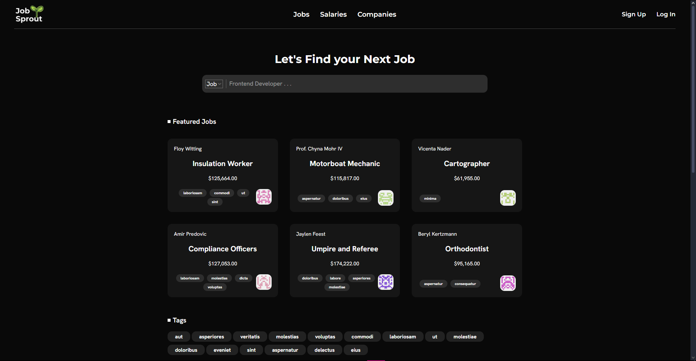
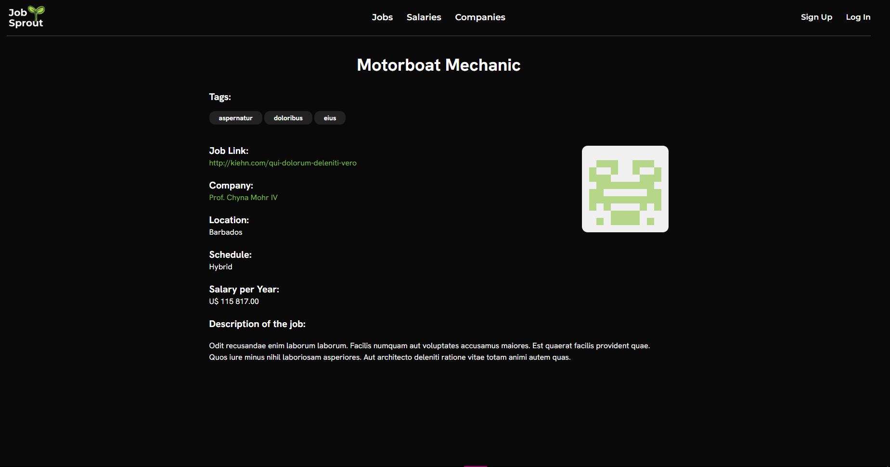

# 

# JobSprout

Uma plataforma de vagas desenvolvida em **Laravel**, **Vite** e **Tailwind CSS**, criada para estudo e prática de desenvolvimento web moderno.  

---

## 📸 Prévia do Projeto

> _Adicione aqui capturas de tela da aplicação_

  
  
  

---

## 🚀 Sobre o Projeto

O **JobSprout** é uma plataforma de vagas onde:

- **Empresas** podem cadastrar-se para:
  - Criar e gerenciar perfis.
  - Postar vagas com descrições detalhadas.
  - Inserir links que redirecionam para os próprios sites.  

- **Usuários** podem:
  - Explorar vagas disponíveis.
  - Buscar oportunidades por **filtros personalizados**.
  - Filtrar por **empresa**.
  - Visualizar vagas **"em Alta"**.

---

## 🛠️ Tecnologias Utilizadas

Este projeto foi construído utilizando as seguintes tecnologias e ferramentas:

-   **Backend:** PHP, Laravel
-   **Frontend:** Tailwind CSS, Blade
-   **Banco de Dados:** MySQL
-   **Ferramentas de Desenvolvimento:** Vite, Composer, Git
